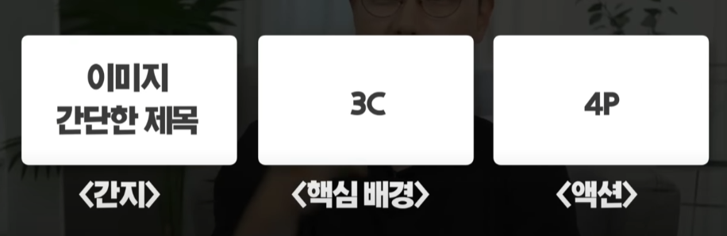
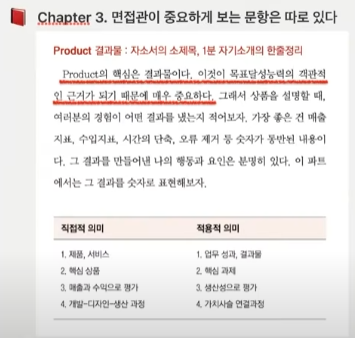
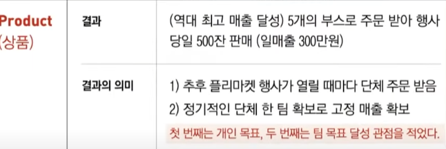
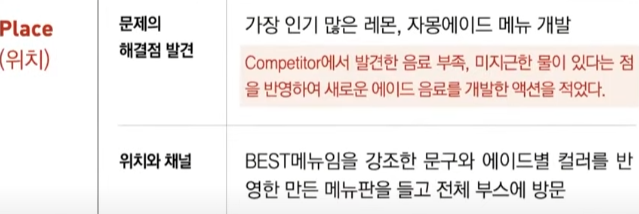
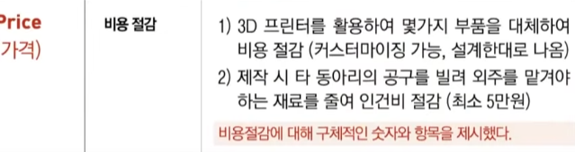
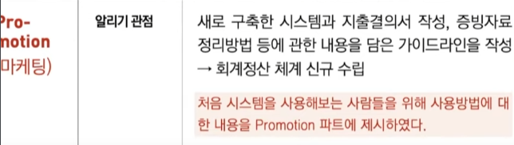
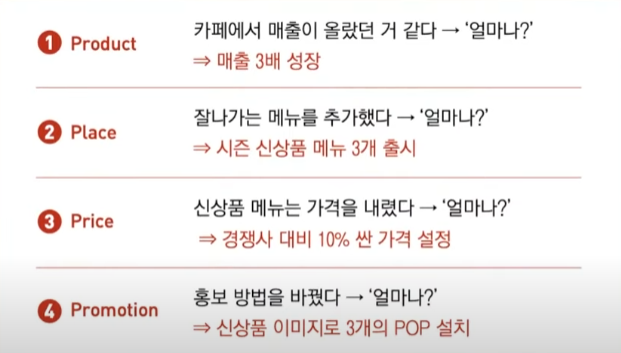

# 포트폴리오 / 자소서 / 이력서 쓰는 법

## 참조
[면접왕 이형](https://www.youtube.com/watch?app=desktop&v=dhH4qQ7N8qY)

## 01. 포트폴리오

깔끔하고 가독성 좋게 제작

### 1-1. 포트폴리오 갯수 : 5~7개 이내
더 많아도 볼 시간이 많지 X

### 1-2. 페이지 구성 : 1pjt 당 3page 이내
더 많아도 볼 시간이 많지 X

### 1-3. 순서 : 가장 임팩트 있는 pjt가 제일 앞
시간순 X

## 02. 자소서

## 참조
[블로그](https://riedel.tistory.com/401#google_vignette)

[자소서 작성](https://youtu.be/oEmienFhFnI?si=Rohca0vX6m_l0bZv)

### 2-1. 실무경험
알바, 인턴, 계약직 >>> 대외활동 (서포터즈, 홍보대사)

- 경험 소개 1page
- 3C : 핵심 배경
- 4P : 내 액션들

 

[경험 리스트업 양식](https://docs.google.com/document/d/18Wp8-f-Wpnygtubw3yb6Ti06s2TlQhuPNc7PGbkBI0g/edit?usp=sharing)

### 2-2. 자소서 작성(논리화)

#### 3C4P

1. 경험에만 초점
2. 수식어 NO -> 수치 & 결과물로 대체
3. 논리구조를 탄탄하게 하라
4. 불필요한 내용은 과감하게 제거
   (3C4P로 설명 못하는 내용)

---
#### 3C4P 개념

|구분|대상|설명|상세|
|-|-|-|-|
|C|CUSTOMER|혜택을 받는 대상|1. 실제 고객   2. 협력부서     3. 상사 동료 팀원 등|
|-|-|대상이 필요로한 것|-|
|C|COMPANY|내가 속했던 곳|-|
|-|-|본인(팀)의 목표|-|
|-|-|본인(팀)의 문제 혹은 기회상황|-|
|-|-|팀 내에서 나의 역할|-|
|C|COMPETITOR|조사한 대항|-|
|-|-|조사 후 적용한 내용|-|
|-|-|-|-|
|P|PRODUCT|결과|(EX)조사 > 개선점|
|-|-|결과의 의미|-|
|-|PLACE|문제 해결점 발견|내가 해결한 것|
|-|-|위치와 채널|-|
|-|PRICE|비용 절감|INPUT 대비 OUTPUT 높은 것(비용/시간)|
|-|PROMOTION|알리기 관점|-|
|-|-|고객 니즈 반영|-|

---
#### 자소서 구조

WHAT : PRODUCT
소제목. 두괄식
"내가 뭘 해서 이 결과를 냈어요"

WHY : CUSTOMER, COMPANY, COMPETITOR
"고객은 누구고 고객의 니즈는 뭐였다"

HOW : PRICE, PLACE, PROMOTION

FIN. INSIGHT

